In this lab you will use an AWS CloudFormation template to deploy a web application that runs on EC2 instances behind an Application Load Balancer (ALB).
This is the link to the template 
https://cloud-mastery-bootcamp.s3.amazonaws.com/lab-guides/solutions-architecture/broken-web-app-challenge.json

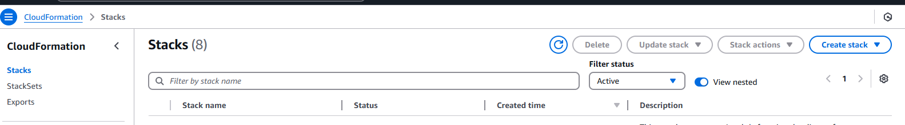

You can save the AWS Cloudformation template locally and upload it on your stack.

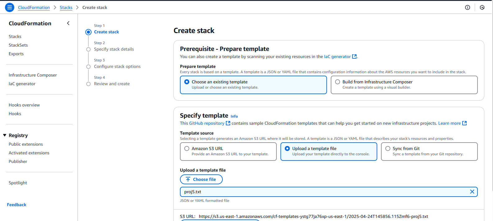

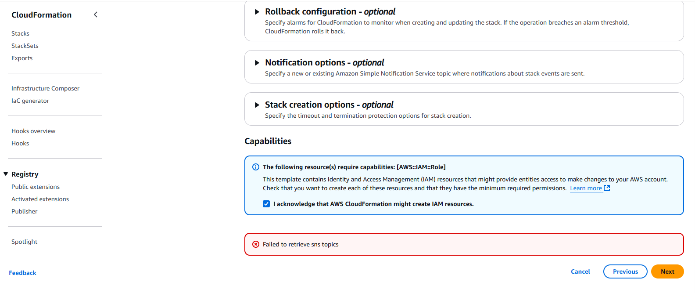

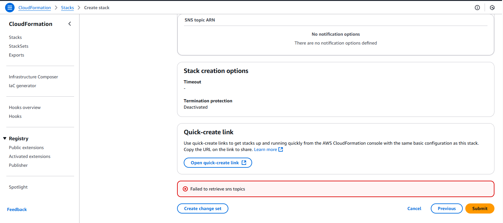

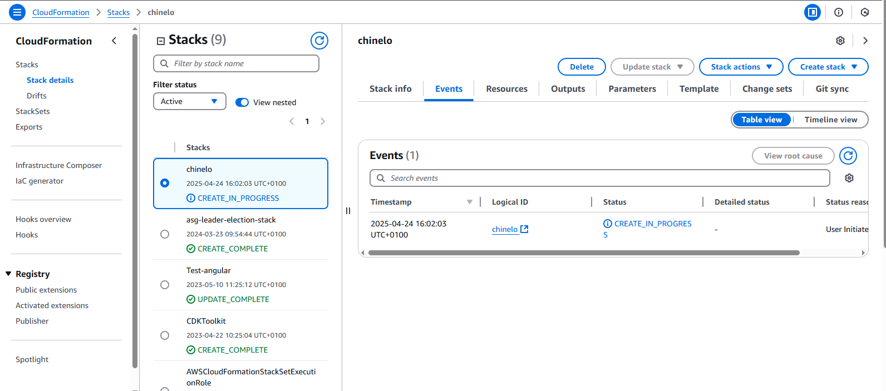

If you try and visit the DNS name of the load balancer you will receive an error.

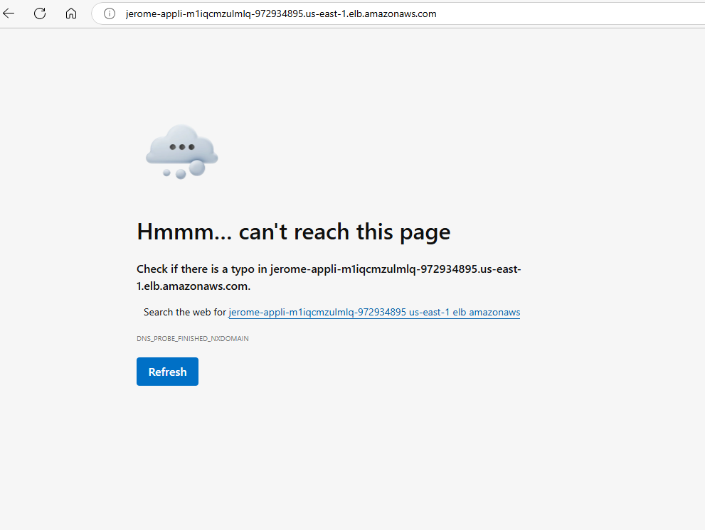

### To fix this issue

* Go to EC2 and navigate down to Target group
* Select your target group 
* Under target click on registers
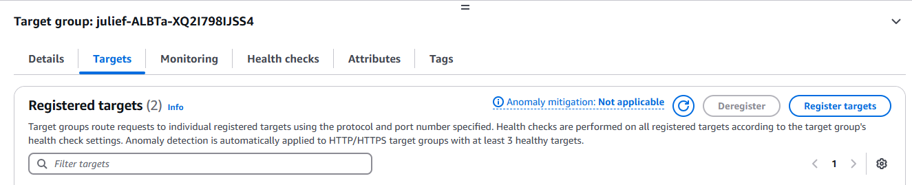

* Select the 2 EC2 instances created
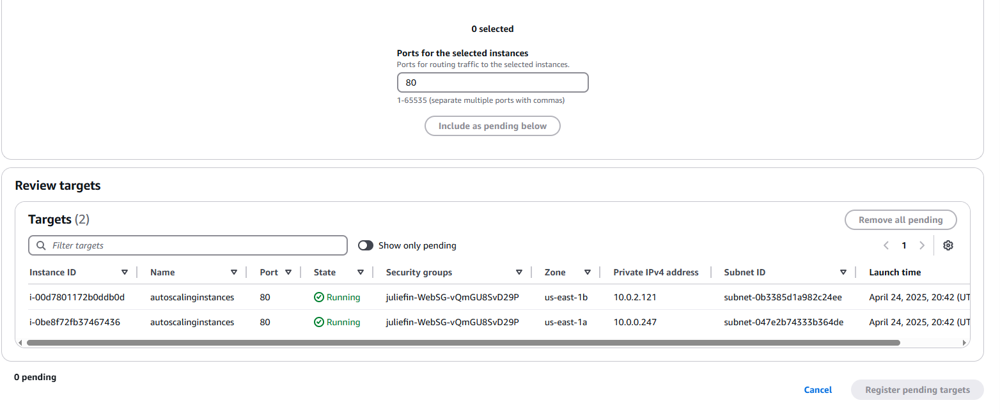

* Select 'include as pending below'
* Clcik on Register pending targets 

### To fix the 2nd issue
* select the target group created 
* Under Health checks
* Click edit, you would notice its Hmtl instead of Html. 
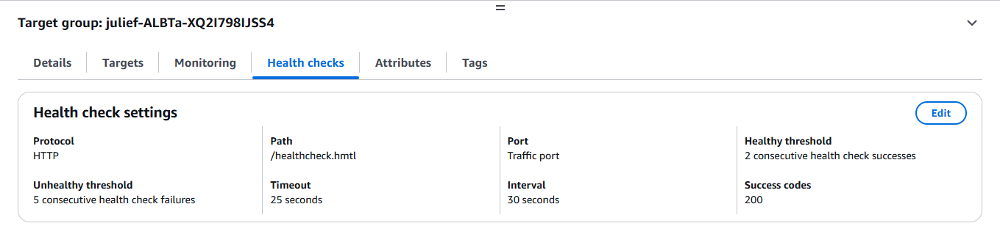
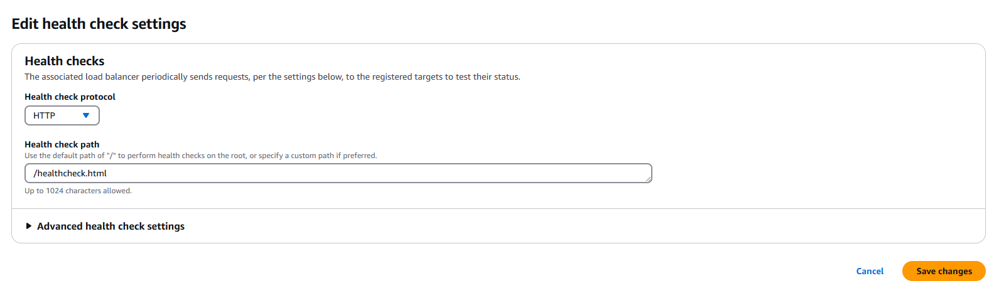

* Change to Html and save changes 

### To fix the 3rd issue
* Go to EC2 and navigate to instances.
* Select one of the instance created and check the security group, you would notice just port 22 is opened. you would need to open up port 80.
"Port 80, which is typically used for HTTP traffic, is currently not open on the server/network. This means that web traffic using the standard HTTP protocol won't be able to reach or be served by the application".
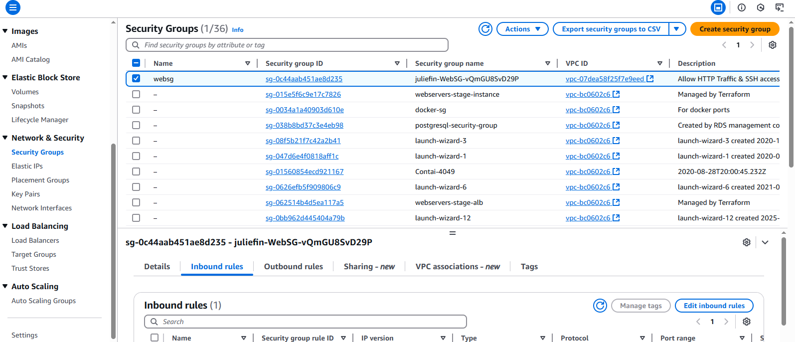

* Select inbound rule and click edit inbound rule.
* Click add rule 
* Choose Http as the type and select anywhere as the source
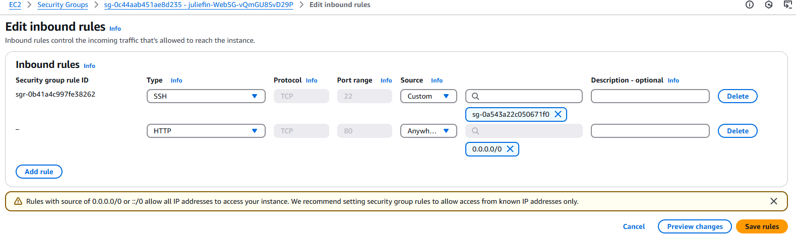
* Save changes 

