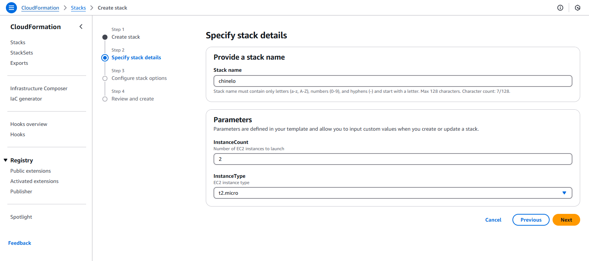

In this lab you will use an AWS CloudFormation template to deploy a web application that runs on EC2 instances behind an Application Load Balancer (ALB).
This is the link to the template 
https://cloud-mastery-bootcamp.s3.amazonaws.com/lab-guides/solutions-architecture/broken-web-app-challenge.json

You can save the AWS Cloudformation template locally and upload it on your stack.

If you try and visit the DNS name of the load balancer you will receive an error.

### To fix this issue

* Go to EC2 and navigate down to Target group
* Select your target group 
* Under target click on registers

* Select the 2 EC2 instances created

* Select 'include as pending below'
* Clcik on Register pending targets 